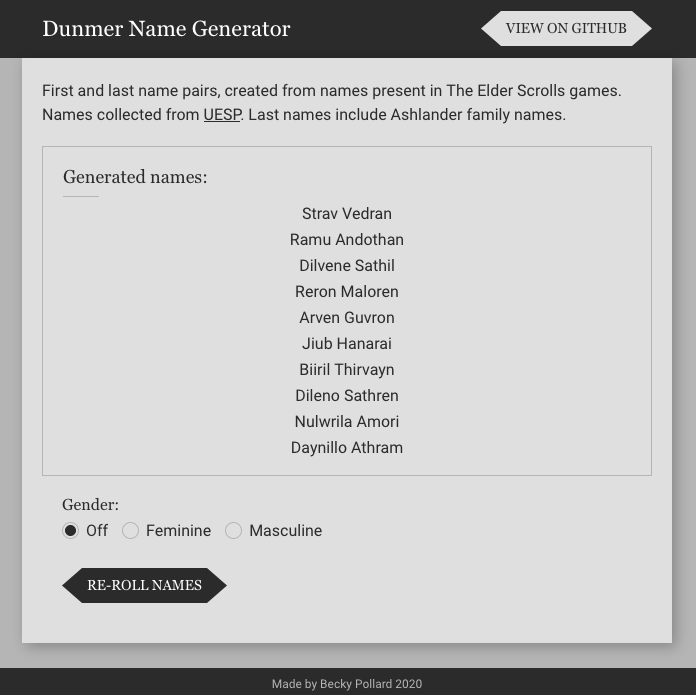

# Dunmer Character Name Generator 

Names scraped from [The Unofficial Elder Scrolls Pages](https://en.uesp.net/wiki/Lore:Dunmer_Names) wiki.

Deployed live on Netlify: [dunmer-name-generator.netlify.app](https://dunmer-name-generator.netlify.app/).

### Why

Because sometimes when I see unnamed NPCs I just want to give them a lore-friendly name, but don't want to look too hard for one. I am a lazy.

### Scraping

The file [scrape.js](./scrape.js) is to be run with node in your terminal, with `node scrape.js`.
This file connests to the UESP page [Lore:Dunmer Names](https://en.uesp.net/wiki/Lore:Dunmer_Names) with Axios, and uses Cheerio to parse the result. To keep things simple the file looks for instances of names within anchor tags and pushes them to an array. Using Node's File System API those arrays are output to a file [names.js](./src/names.js) for use in the generator.

### Project Todo
- [x] Scrape names from UESP, save to a JavaScript array (names.js).
- [x] On request (button), generate a first and last name.
- [x] Add option to specify character gender.
- [x] Style app.
- [x] Accessibility audit. (Lighthouse: 100)

### Future Tinkering
- Add more TES races to the name generator!
